# Performance Profiling Report

## Environment

- React version: 19.2
- Browser: Chrome 148
- Tool: React DevTools Profiler

---

## Phase 1: Baseline (Before Optimization)

## 1. Sorting Countries

**Commit Duration:** 2.7s  
**Render Duration:** 448 ms

### Screenshots

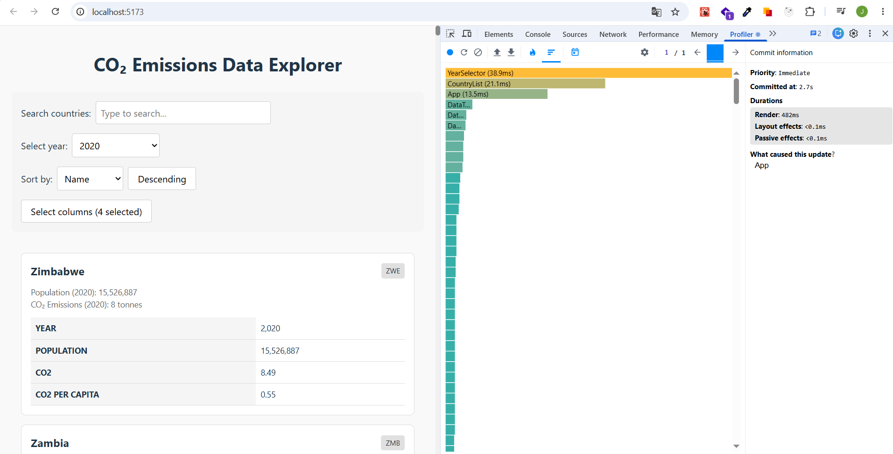

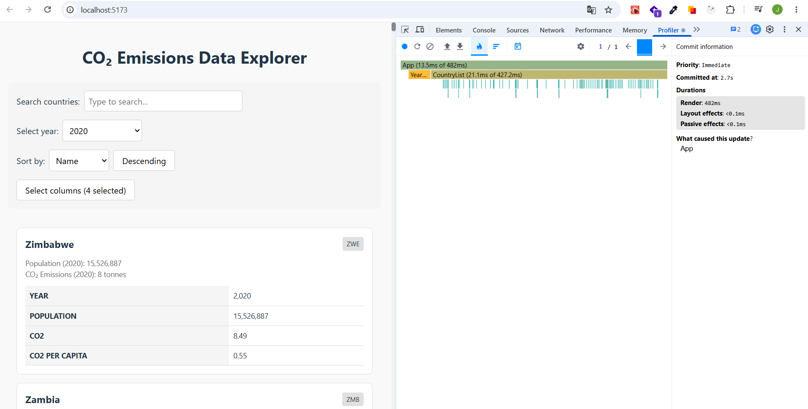

### Findings

- Component YearSelector re-rendered unnecessarily
- Every single CountryCard re-rendered

---

## 2. Searching for a Country

**Commit Duration:** 2.3 s  
**Render Duration:** 233 ms

### Screenshots

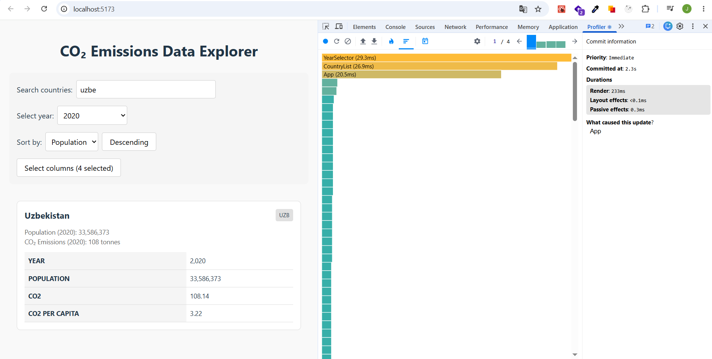

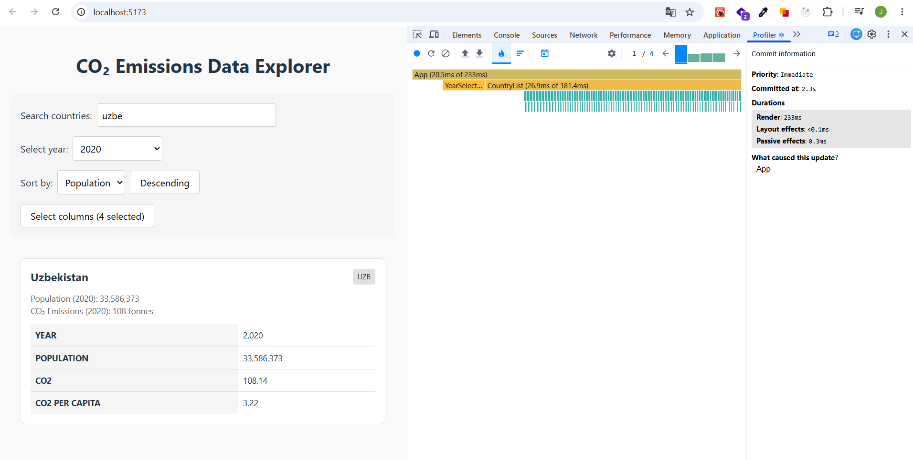

### Findings

- Every keystroke triggers a full re-render of all rows
- Component YearSelector re-rendered unnecessarily

---

## 3. Selecting a Different Year

**Commit Duration:** 3.2 s  
**Render Duration:** 514 ms

### Screenshots

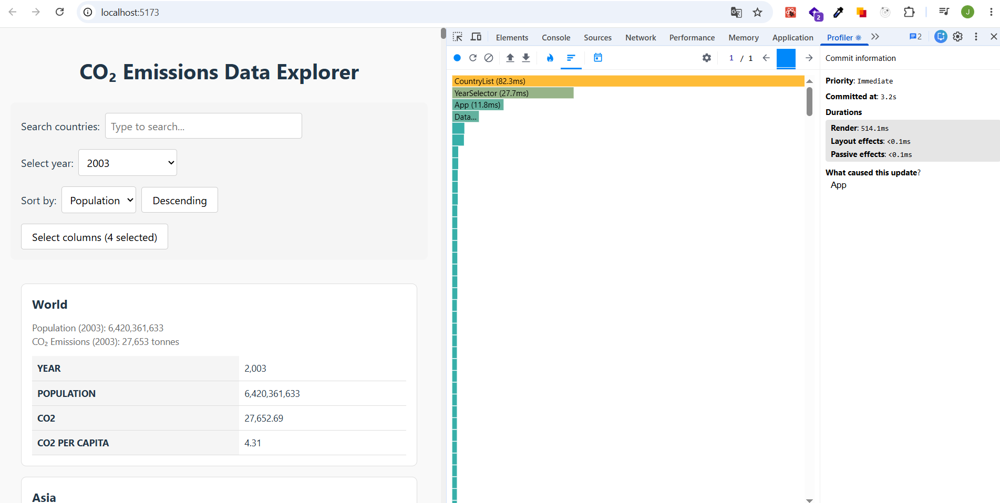

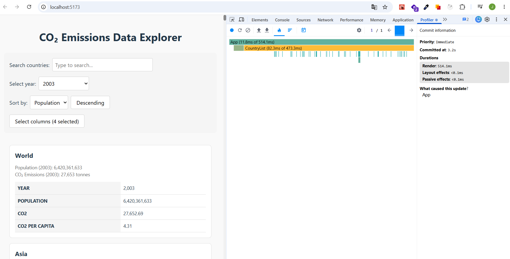

### Findings

- Every single CountryCard re-rendered

---

## 4. Toggling Columns

**Commit Duration:** 1.6 s  
**Render Duration:** 478 ms

### Screenshots

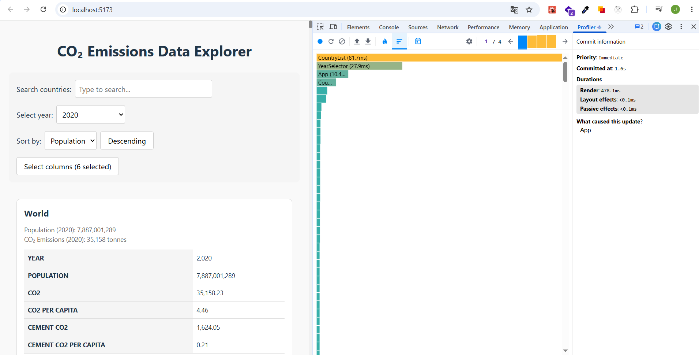

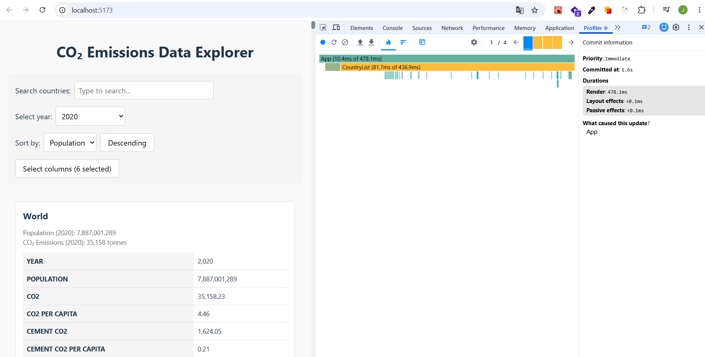

### Findings

- Component YearSelector re-rendered unnecessarily
- Every single CountryCard re-rendered

---

## Phase 2: Optimizations Applied

The following optimizations were implemented:

- **`useCallback`** — All event handlers in `App` wrapped with `useCallback` and functional state updates to ensure stable references
- **`useMemo`** — Computed values (`years`, `availableColumns`, `filteredCountries`, `yearDataMap`, `population`, `co2`, `record`) memoized to avoid redundant calculations
- **`React.memo`** — All components (`CountryCard`, `CountryList`, `DataTable`, `SearchBar`, `YearSelector`, `ColumnModal`) wrapped to skip re-renders when props unchanged
- **Proper keys** — Replaced index-based keys with stable unique values (`country.id`, column name, year value) across all lists and tables
- **Virtualization** — Replaced full DOM rendering with `react-window` `List` component so only visible rows render instead of all ~200 country cards

---

## Phase 3: Final Profiling (After Optimization)

## 1. Sorting Countries

**Commit Duration:** 1.8 s  
**Render Duration:** 38 ms

### Screenshots

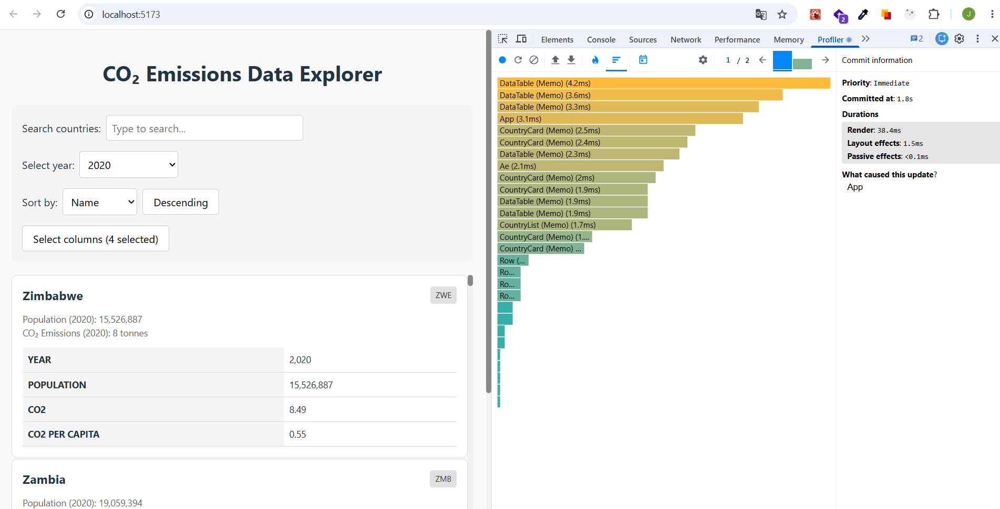
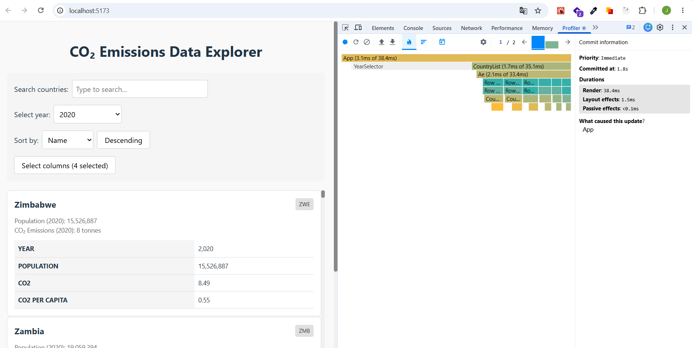

### Findings

- Only visible virtualized rows re-rendered
- YearSelector did not re-render (stable `useCallback` reference)
- CountryCards outside viewport were not rendered at all

---

## 2. Searching for a Country

**Commit Duration:** 1.6 s  
**Render Duration:** 20 ms

### Screenshots

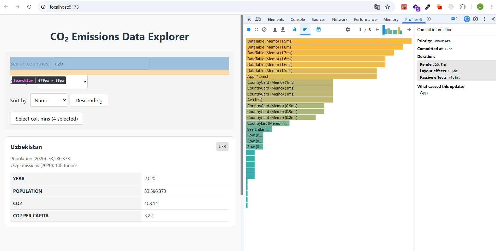
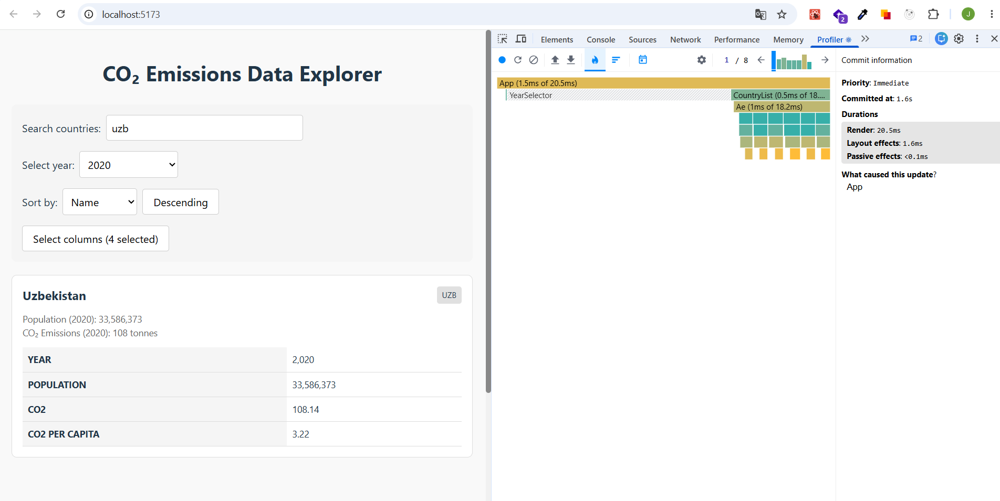

### Findings

- Only visible virtualized rows re-rendered
- `filteredCountries` useMemo prevented redundant filtering on unrelated state changes

---

## 3. Selecting a Different Year

**Commit Duration:** 2 s  
**Render Duration:** 56 ms

### Screenshots

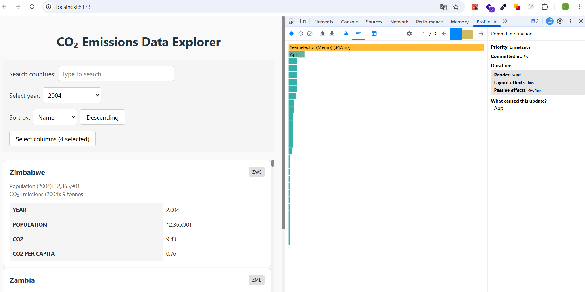
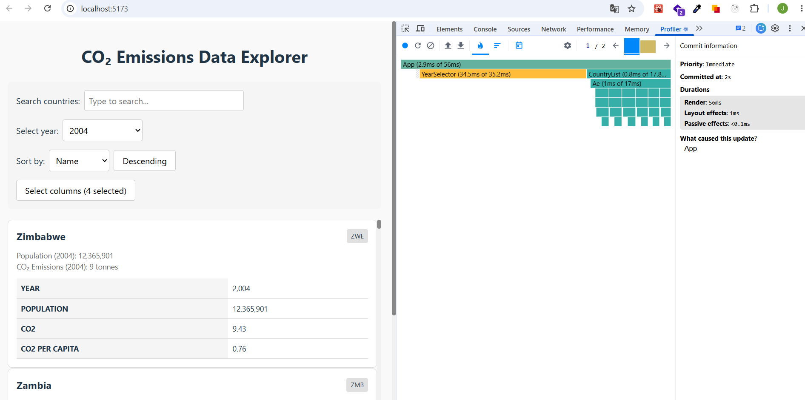

### Findings

- Only visible rows re-rendered
- `yearDataMap` memoized per CountryCard — no redundant map creation

---

## 4. Toggling Columns

**Commit Duration:** 1 s  
**Render Duration:** 15 ms

### Screenshots

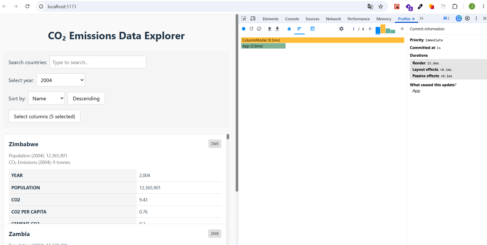
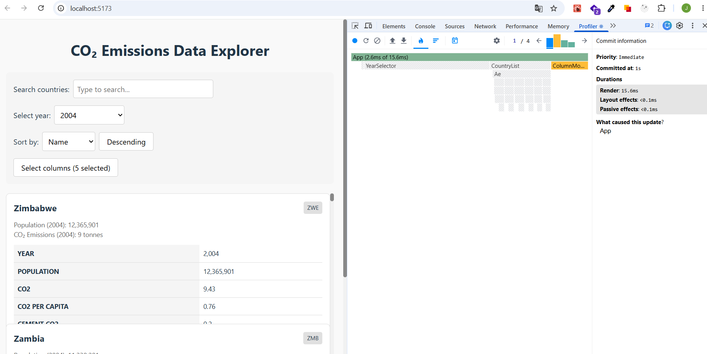

### Findings

- YearSelector did not re-render
- Only visible CountryCards re-rendered

---

## Phase 4: Comparison Summary

| Interaction    | Before Render | After Render | Improvement |
| -------------- | ------------- | ------------ | ----------- |
| Sorting        | 448 ms        | 38 ms        | 91 % faster |
| Searching      | 233 ms        | 20 ms        | 91 % faster |
| Year Selection | 514 ms        | 56 ms        | 89 % faster |
| Column Toggle  | 478 ms        | 15 ms        | 97 % faster |
